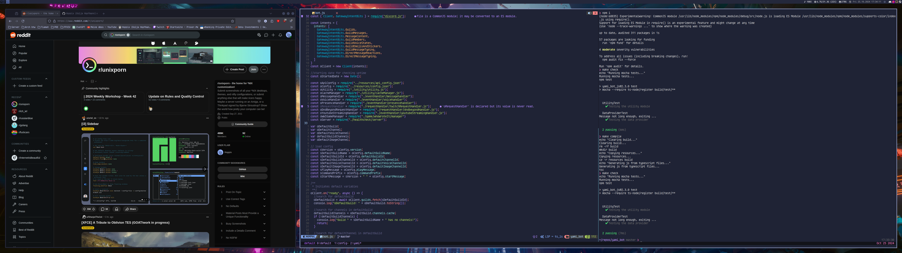

# hoppix dotfiles

These are my own dotfiles for ease of convenience and setup.




## own rc files

own rc files just source custom rc in default rc file and everything is set up.

```sh
source ~/.config/hoppix/.hoppix_zshrc
```

## general
* Everything is configured with tokyonight theme from vscode: https://github.com/enkia/tokyo-night-vscode-theme
* As font a Nerd font is required, eg. Agave Nerd Font

## tmux

* tpm as package manager
* vim-tmux navigation
* mouse support on

## neovim

https://nvchad.com/

### general
I use nvchad for most of my configuration, this includes:

* Navigation: [harpoon](https://github.com/ThePrimeagen/harpoon)
* Navigation: [telescope](https://github.com/nvim-telescope/telescope.nvim)
* Autocompletion and Language support: [lsp-zero](https://github.com/VonHeikemen/lsp-zero.nvim)
* Debugging: [dap](https://github.com/mfussenegger/nvim-dap)
* Syntax highliting: [treesitter](https://github.com/nvim-treesitter/nvim-treesitter)

### Debugging

Debugging is configured for:

* python
* go

#### Custom debug config

Similar to a `.vscode/launch.json` you can configure your debugger with args
and environment variables. Just create `.vscode/dap_config.lua` in your project workspace
* python
```lua
local dap = require('dap')

dap.adapters.python = {
    type = 'executable',
    command = os.getenv('HOME') .. '/.virtualenvs/debugpy/bin/python',
    args = { '-m', 'debugpy.adapter' },
}

dap.configurations.python = {
    {
        type = 'python',
        request = 'launch',
        name = 'Launch file',
        program = '${file}',
        pythonPath = function()
            return '/usr/bin/python' -- Or your custom python path
        end,
        env = {
            FOO = 'project_specific_value',
            BAR = 'another_project_value',
        },
    },
}
```

* golang
```lua
-- dap_config.lua
local dap = require('dap')


local dapgo = require('dap-go')

dapgo.setup()

dap.configurations.go = {
    {
        type = 'go',
        request = 'launch',
        name = 'launch custom',
        program = '${file}',
        cwd = '${workspaceFolder}',
        env = {
            FOO = 'project_specific_value',
            BAR = 'another_project_value',
        },
    },
}

```


