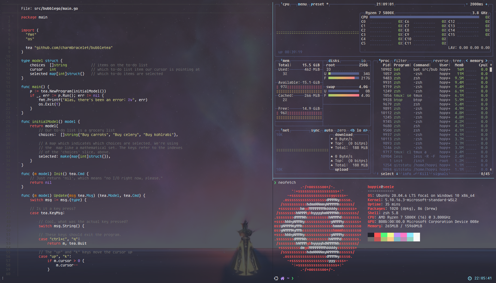
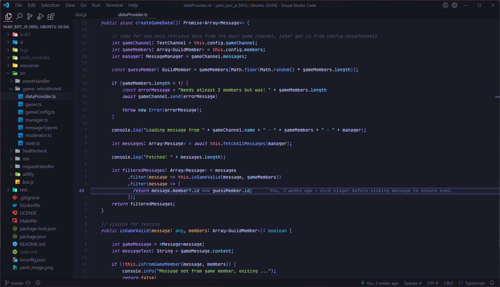

# hoppix dotfiles

These are my own dotfiles for ease of convenience and setup.




## own rc files

own rc files just source custom rc in default rc file and everything is set up.

```sh
source ~/.config/hoppix/.hoppix_zshrc
```

## general
* Everything is configured with tokyonight theme from vscode: https://github.com/enkia/tokyo-night-vscode-theme
* As font a Nerd font is required, eg. Agave Nerd Font

## tmux

* tpm as package manager
* vim-tmux navigation
* mouse support on

## neovim

https://nvchad.com/

### general
I use nvchad for most of my configuration, this includes:

* Navigation: [harpoon](https://github.com/ThePrimeagen/harpoon)
* Navigation: [telescope](https://github.com/nvim-telescope/telescope.nvim)
* Autocompletion and Language support: [lsp-zero](https://github.com/VonHeikemen/lsp-zero.nvim)
* Debugging: [dap](https://github.com/mfussenegger/nvim-dap)
* Syntax highliting: [treesitter](https://github.com/nvim-treesitter/nvim-treesitter)

### Debugging

Debugging is configured for:

* python
* java
* javascript
* go


